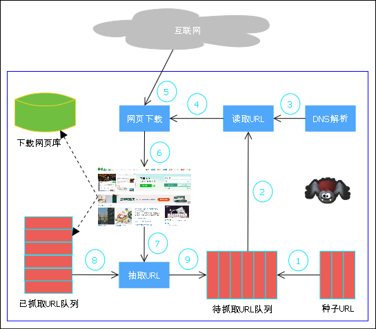

# 网络爬虫介绍

## 通用网络爬虫框架
如下图所示是一个通用的网络爬虫框架



爬虫的流程为：

1. 首先从互联网页面中精心选择一部分网页，以这些网页的链接地址作为*种子URL*，将这些种子URL放入*待抓取URL队列*中
2. 爬虫从*待抓取URL队列*依次*读取*
3. 并将URL通过*DNS解析*，把链接地址转换为网站服务器对应的IP地址
4. 然后将其和网页相对路径名称交给*网页下载器*
5. *网页下载器*负责页面内容的下载
6. 对于下载到本地的网页，一方面将其存储到*页面库*中，等待建立索引等后续处理；另一方面将下载网页的URL放*已抓取URL队列*中，这个队列记载了爬虫系统已经下载过的网页URL，以避免网页的重复抓取
7. 对于刚下载的网页，从中*抽取*出所包含的所有链接信息
8. 并在*已抓取URL队列*中检查
9. 如果发现链接还没有被抓取过，则将这个URL放入*待抓取URL队列*末尾，在之后的抓取调度中会下载这个URL对应的网页

如此这般，形成循环，直到*待抓取URL队列*为空，这代表这爬虫系统已经将能够抓取的网页尽数抓完，此时完成了一轮完整的抓取过程。

根据上面的流程我们可以写出爬虫的伪码：
```python
waiting_queue = Queue()
downloaded_set = set()
downloader = Downloader()

seed_url = "http://www.example.com"
waiting_queue.push(seed_url)

while(True):
    if waiting_queue is empty:
        break
    
    current_url = waiting_queue.pop()

    page = downloader.download(current_url)
    store(page)
    downloaded_set.add(current_url)

    for url in extract_url(page):
        if url in downloaded_set:
	    continue
	waiting_queue.push(url)
```

### 参考资料
1. [这就是搜索引擎-核心技术详解](https://book.douban.com/subject/7006719/)，作者：张俊林 
2. [如何入门 Python 爬虫？](https://www.zhihu.com/question/20899988/answer/24923424)，作者：谢科

